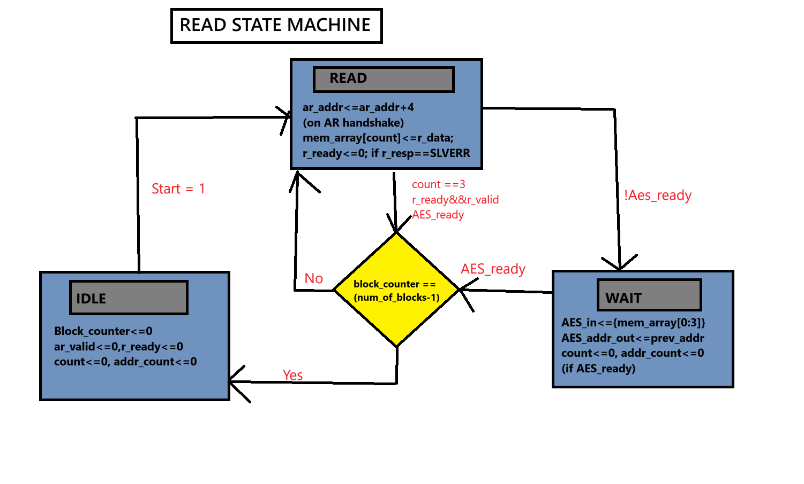
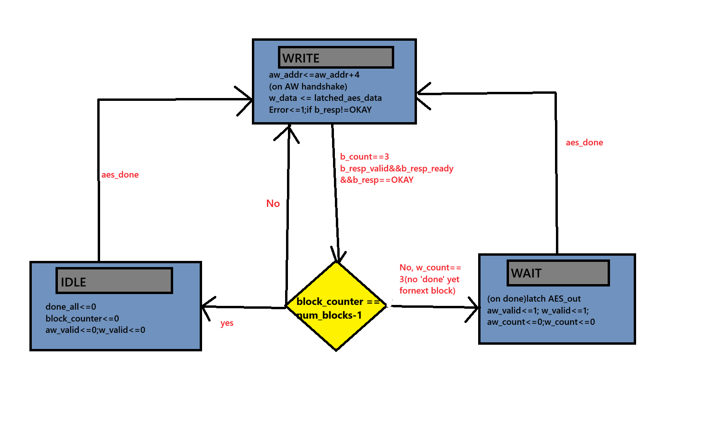

# AES-128-Encryption-IP-with-AXI4-Lite-Interface
Implemented a AES-128 10 stage pipelined IP AXI-4 Lite interface for interfacing with memory and CPU ,it fetches the plain text and writes the encrypted cipher text back to the slave memory without any CPU intervention and stalls.

---

## Key Design Features

- **Dual State Machines**  
  Separate read and write FSMs ensure reliable AXI handshakes with overlapping channels to reduce communication stalls in the design

- **AXI-Lite Protocol**  
  Fully compliant handshaking: AR, R, AW, W, and B channels.

- **Byte Address Conversion**  
  AXI uses byte addressing; this design converts word-based addresses accordingly.

- **Dynamic Key update mode**  
  Implemented On-the-Fly Key expansion in the pipeline to support dynamic key update mode

- **Status and control registers**  
  Implemented control registers for the CPU to write control signals to the IP and status register to see the status of the IP from the CPU.

---
## Architecture Overview

---
## AES-128 Pipeline
Designed a 11-stage AES-128 Electronic code book (ECB) mode of operation pipeline. the theorotical throughput that pipeline can produce is 1 cipher text/clock cycle after the pipeline is filled completely. the pipeline supports dynamic key updates using on the fly key expansion, and implemented pipeline registers for passing the address and the round texts through the pipeline. in the pipeline the plain text is taken from the read FSM and after the encryption it is written back to the memory using the write FSM.

## State Machine Overview

### Read FSM

| State       | Description |
|-------------|-------------|
| `IDLE` | Waits for start |
| `READ` | reads 4 32 bit data and packs it into 128 bit plain text through channel overlap. |
| `WAIT` | if !AES_ready it waits for the pipeline, it is for backpressure handling |

### Write FSM

| State       | Description |
|-------------|-------------|
| `IDLE` | Waits for aes_done |
| `WRITE` | writes the 128 bit cipher in 4 32 bit stream using channel overlap. |
| `WAIT` | if the next cipher text isn't ready it waits for the pipeline, it is for backpressure handling |

---

## Memory Mapped I/O architecture

We are using memory mapped I/O to communicate with the IP using a unique address to communicate with the IP which is accessed by CPU on a shared bus conveniently. Here the status and the control registers are accessed by the CPU using the AXI Lite address mapped bus architecture, the control register is only written and the status registers are only read, so instead of giving separate AXI 5 channels to each of the registers, i have give only write AXI-lite channel to the control register, and only gave read AXI-lite channel to the status registers.

## Testing

Successfully verified the pipeline by Stress testing the AES Pipeline with 500 AES vectors with dynamic key updates through test bench by AXI-4 Lite
and achieved a theorotical throughput of 12.8 gbps (excluding the AXI communication stalls) at 100 Mhz clock frequency. The max frequency the design can run without any timing errors is 400 Mhz.

