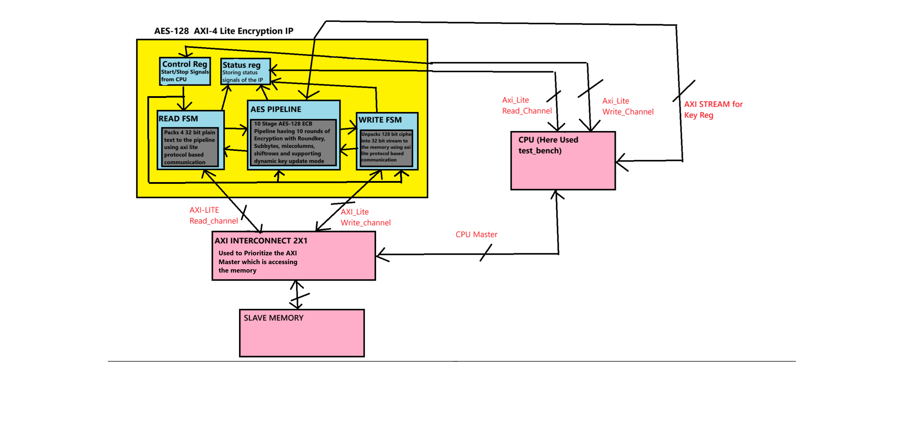

# AES-128-Encryption-IP-with-AXI4-Lite-Interface
Implemented a AES-128 10 stage pipelined IP AXI-4 Lite interface for interfacing with memory and CPU

---

## Key Design Features

- **Dual State Machines**  
  Separate read and write FSMs ensure reliable AXI handshakes with overlapping channels to reduce communication stalls in the design

- **AXI-Lite Protocol**  
  Fully compliant handshaking: AR, R, AW, W, and B channels.

- **Byte Address Conversion**  
  AXI uses byte addressing; this design converts word-based addresses accordingly.

- **Dynamic Key update mode**  
  Implemented On-the-Fly Key expansion in the pipeline to support dynamic key update mode

- **Status and control registers**  
  Implemented control registers for the CPU to write control signals to the IP and status register to see the status of the IP from the CPU.

---
## Architecture Overview

---
## State Machine Overview

### Read FSM

| State       | Description |
|-------------|-------------|
| `IDLE` | Waits for start |
| `READ` | reads 4 32 bit data and packs it into 128 bit plain text through channel overlap. |
| `WAIT` | if !AES_ready it waits for the pipeline, it is for backpressure handling |

